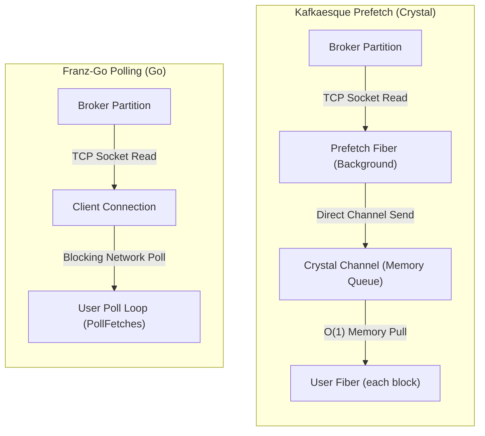

# Kafkaesque (kafkaesque.cr)

[](https://github.com/eltony81/kafkaesque.cr)

> [!CAUTION]
> This library is optimized specifically to support applications built with the [cryspace](https://github.com/eltony81/cryspace) framework, aiming to outperform Kafka clients in other languages for this specific use case. However, it has not been tested for general-purpose use, may contain bugs, and is not recommended for production environments.

Kafkaesque is a modern, dependency-light Crystal client library for Apache Kafka. It includes support for KIP-848 consumer group protocols, transactional delivery, and pluggable OAuthBearer (OIDC) token authentication out-of-the-box.

---

## Installation

Add this to your application's `shard.yml`:

```yaml
dependencies:
  kafkaesque:
    github: eltony81/kafkaesque.cr
```

Then run `shards install`.

---

## System Dependencies & Compilation

Kafkaesque supports TLS/SSL connections and high-performance compression codecs (Snappy, LZ4, Zstandard) via native C bindings. The compiler requires these dependency libraries to link successfully.

### 🐧 Linux (Ubuntu/Debian)

Install the development packages using your package manager:
```bash
sudo apt-get install libssl-dev libsnappy-dev liblz4-dev libzstd-dev
```
Then build your application:
```bash
crystal build src/your_app.cr --release
```

### 🪟 Windows

On Windows, the Crystal compiler uses the MSVC linker. You need to install and link the libraries using `vcpkg` or `MSYS2`.

#### 1. Dynamic Linking (using `vcpkg`)
Install the package dependencies:
```cmd
vcpkg install openssl:x64-windows snappy:x64-windows lz4:x64-windows zstd:x64-windows
vcpkg integrate install
```
Then compile standardly (MSVC will auto-detect the linked libraries):
```cmd
crystal build src/your_app.cr --release
```

#### 2. Static Linking (Standalone Executable)
To generate a self-contained `.exe` without requiring external DLLs, pass the static libraries as link flags:
```cmd
crystal build src/your_app.cr --release --link-flags="lz4_static.lib zstd_static.lib snappy_static.lib libssl.lib libcrypto.lib"
```

---

## Configuration

Kafkaesque configurations can be constructed programmatically, loaded via a YAML file, or overridden through environment variables (useful for containerized/Docker environments).

### Configuration Loader

To load settings dynamically:

```crystal
require "kafkaesque"

# Automatically looks for config.yml (or custom path) and layers environment variables
config_file = ENV["KAFKA_CONFIG_FILE"]? || "config.yml"
producer_config = Kafkaesque::ConfigLoader.load_producer_config(config_file)
consumer_config = Kafkaesque::ConfigLoader.load_consumer_config(config_file)
```

### Configuration YAML Structure

A complete YAML configuration (`config.yml`):

```yaml
bootstrap_servers:                     # Shared: List of brokers
  - "localhost:9093"
group_id: "my-consumer-group"          # Consumer-only: Consumer group identifier
initial_offset_smallest: "true"        # Consumer-only: "true" resets to earliest offset, "false" to latest
compression_type: "lz4"                # Producer-only: gzip, snappy, lz4, zstd

# Custom settings maps directly under settings
settings:
  # Producer-only settings
  enable.idempotence: "true"
  acks: "all"
  linger.ms: "20"
  batch.num.messages: "10000"
  retries: "5"
  retry.backoff.ms: "100"
  
  # Shared OAuthBearer / OIDC authentication settings
  sasl.oauthbearer.token.endpoint.url: "http://localhost:8080/realms/kafka-auth/protocol/openid-connect/token"
  sasl.oauthbearer.client.id: "kafka-client"
  sasl.oauthbearer.client.secret: "kafka-secret"
```

### Environment Variables

Environment variables take precedence over settings loaded from the YAML file.

- **`KAFKA_BOOTSTRAP_SERVERS`**: Comma-separated list of brokers (e.g. `localhost:9093,localhost:9094`).
- **`KAFKA_GROUP_ID`**: The consumer group identifier.
- **`KAFKA_COMPRESSION_TYPE`**: Compression codec (`gzip`, `snappy`, `lz4`, `zstd`).
- **`KAFKA_INITIAL_OFFSET_SMALLEST`**: Set to `"true"` to start from the earliest offset.
- **`KAFKA_SETTING_<KEY>`**: Any custom setting where `<KEY>` has underscores replaced by dots and is lowercased. E.g., `KAFKA_SETTING_ENABLE_IDEMPOTENCE=true` maps to `enable.idempotence = "true"`.
- **`KAFKA_SASL_<KEY>`**: Any SASL setting. E.g., `KAFKA_SASL_OAUTHBEARER_CLIENT_ID=kafka-client` maps to `sasl.oauthbearer.client.id = "kafka-client"`.

### Inspecting Configurations

Both the `Producer` and `Consumer` expose a `configurations` method that returns a formatted `String` showing the bootstrap servers and all active configuration settings. This is useful for verbose startup logging and debugging:

```crystal
puts producer.configurations
# Or:
puts consumer.configurations
```

Example Output:
```text
Bootstrap Servers: localhost:9092
Settings:
  enable.idempotence: true
  acks: all
  linger.ms: 20
```

---

## Configuration Parameter Directory

### General & Producer Configuration

| Parameter Key | Type | Default | Description |
|---|---|---|---|
| `bootstrap_servers` | `Array(String)` | `["localhost:9092"]` | Initial list of broker hosts and ports. |
| `compression.type` or `compression_type` | `String` | `none` | Compression codec to use. Choices: `gzip`, `snappy`, `lz4`, `zstd`. |
| `enable.idempotence` | `String` | `false` | Enable idempotent delivery (ensures exactly-once semantics per partition). |
| `acks` | `String` | `1` | Number of broker acknowledgments required before completing write. Options: `all` (-1), `0` (no ack), `1` (leader ack). |
| `linger.ms` | `String` | `0` | Delay (in milliseconds) to wait for additional messages to accumulate before sending a batch. |
| `batch.num.messages` | `String` | `1000` | Maximum number of messages to bundle in a single batch. |
| `retries` | `String` | `3` | Number of times to retry producing a message before failing. |
| `retry.backoff.ms` | `String` | `100` | Time to wait before attempting a retry. |
| `transactional.id` | `String` | `nil` | Unique ID enabling transactional delivery across restarts. |
| `buffer.memory` | `String` | `33554432` | Size limit (in bytes) of the producer's batch accumulator queue. |
| `max.block.ms` | `String` | `60000` | Max duration (in milliseconds) a produce call will block when the memory budget is full before raising a `BufferExhaustedException`. |

### Consumer Configuration

| Parameter Key | Type | Default | Description |
|---|---|---|---|
| `group.id` or `group_id` | `String` | `default-group` | Unique string identifying the consumer group. |
| `group.instance.id` | `String` | `nil` | Static member identifier to prevent frequent rebalances. |
| `session.timeout.ms` | `String` | `30000` | Timeout used to detect consumer failures. |
| `heartbeat.interval.ms` | `String` | Auto-calculated | Interval between heartbeats sent to the coordinator. |
| `initial_offset_smallest` | `Bool` | `false` | Corresponds to `auto.offset.reset = smallest` (earliest offset). |
| `auto.offset.reset` | `String` | `largest` | Reset policy: `smallest` (earliest), `largest` (latest). |
| `enable.auto.commit` | `String` | `true` | Periodically commit offsets in the background. |
| `auto.commit.interval.ms` | `String` | `5000` | Interval to auto-commit offsets. |
| `fetch.min.bytes` | `String` | `1` | Minimum data amount the broker should return for a fetch request. |
| `fetch.max.bytes` | `String` | `1048576` | Max data limit (in bytes) for a single network fetch request. |
| `max.partition.fetch.bytes` | `String` | `1048576` | Max partition-level data limit (in bytes) fetched from a single broker partition. |
| `topic.metadata.refresh.interval.ms` | `String` | `300000` | Period (in milliseconds) at which the client updates active topic metadata in the background. |

### SASL & OAuthBearer (OIDC) Settings

| Parameter Key | Type | Default | Description |
|---|---|---|---|
| `sasl.token` / `sasl.password` | `String` | `nil` | Plaintext token or secret for basic SASL connections. |
| `sasl.oauthbearer.token.endpoint.url` | `String` | `nil` | Keycloak/OIDC server URL endpoint to fetch OAuth access tokens. |
| `sasl.oauthbearer.client.id` | `String` | `nil` | The Client ID used for client credentials flow. |
| `sasl.oauthbearer.client.secret` | `String` | `nil` | The Client Secret used for client credentials flow. |
| `sasl.oauthbearer.token.refresh.interval.ms` | `String` | `300000` | Period (in milliseconds) at which the client refreshes the OAuth access token in the background. |

### Enterprise Observability & Advanced Security Settings

| Parameter Key | Type | Default | Description |
|---|---|---|---|
| `metrics.prometheus.port` | `String` | `nil` | Port on which the embedded Prometheus HTTP server listens. If not set, the metrics HTTP server is disabled. |
| `ssl.keystore.reload.interval.ms` | `String` | `0` (disabled) | Frequency (in milliseconds) at which the dynamic mTLS monitor scans keystore files for changes and reloads them. |

---

## Detailed Tutorials

### 1. Simple Producer

```crystal
require "kafkaesque"

# Load config
config = Kafkaesque::ConfigLoader.load_producer_config("config.yml")
producer = Kafkaesque::Producer.new(config)

begin
  topic = "my-topic"
  payload = "Hello from Kafkaesque!".to_slice
  key = "message_key_1".to_slice
  
  headers = {
    "correlationid" => "12345",
    "client_id"     => "my-producer-app"
  }

  # Write record
  producer.produce(topic, payload, key: key, headers: headers)
  
  # Ensure all batched messages are dispatched
  producer.flush(timeout_ms: 1000)
  puts "Message sent successfully!"
ensure
  producer.close
end
```

### 2. Transactional Producer

Transactions ensure that messages across multiple partitions are written atomically.

```crystal
require "kafkaesque"

# Setup configuration with a transactional ID
config = Kafkaesque::Producer::Config.new(
  bootstrap_servers: ["localhost:9093"],
  settings: {
    "transactional.id" => "tx-prod-1",
    "enable.idempotence" => "true"
  }
)
producer = Kafkaesque::Producer.new(config)

begin
  # Begin transactional scope
  producer.begin_transaction

  producer.produce("topic-a", "Payload A".to_slice)
  producer.produce("topic-b", "Payload B".to_slice)

  # Commit both writes atomically
  producer.commit_transaction
  puts "Transaction committed successfully!"
rescue ex
  # Rollback changes on failure
  producer.abort_transaction
  puts "Transaction aborted: #{ex.message}"
ensure
  producer.close
end
```

### 3. Simple Consumer

The consumer uses standard fibers and blocks the loop until messages arrive.

```crystal
require "kafkaesque"

config = Kafkaesque::ConfigLoader.load_consumer_config("config.yml")
consumer = Kafkaesque::Consumer.new(config)

consumer.subscribe(["my-topic"])

# Register rebalance event callbacks (Optional)
consumer.on_partitions_assigned do |partitions|
  puts "Partitions assigned: #{partitions.inspect}"
end

consumer.on_partitions_revoked do |partitions|
  puts "Partitions revoked: #{partitions.inspect}"
end

# Setup termination signal handling
spawn do
  Process.on_terminate do
    puts "Shutdown requested..."
    consumer.close
    exit
  end
end

begin
  # Block and consume events sequentially
  consumer.each do |message|
    puts "Offset: #{message.offset} | Key: #{message.key} | Value: #{message.value}"
  end
ensure
  consumer.close
end
```

### 4. Regex Consumer Subscription

You can subscribe to topics dynamically matching a Regular Expression. A background discovery loop automatically identifies newly created topics in the cluster that match the pattern and subscribes the consumer to them.

```crystal
require "kafkaesque"

config = Kafkaesque::ConfigLoader.load_consumer_config("config.yml")
consumer = Kafkaesque::Consumer.new(config)

# Subscribe to any topic starting with "sensor-"
consumer.subscribe(/^sensor-.*$/)

begin
  consumer.each do |message|
    puts "Topic: #{message.topic} | Value: #{message.value}"
  end
ensure
  consumer.close
end
```

### 5. Manual Partition Assignment

If you need to consume from a specific set of partitions without dynamic consumer group partition assignment (rebalances) or group heartbeats, you can assign them manually using `Consumer#assign`.

```crystal
require "kafkaesque"

config = Kafkaesque::Consumer::Config.new(["localhost:9092"])
consumer = Kafkaesque::Consumer.new(config)

# Manually assign partition 0 and 1 of "my-topic"
consumer.assign([
  Kafkaesque::TopicPartition.new("my-topic", 0),
  Kafkaesque::TopicPartition.new("my-topic", 1)
])

begin
  consumer.each do |message|
    puts "Topic: #{message.topic} | Partition: #{message.partition} | Value: #{message.value}"
  end
ensure
  consumer.close
end
```

### 6. Unit Testing with Mock Broker

Kafkaesque provides a built-in `MockBroker` — a real `TCPServer` on a random local port that speaks the actual Kafka wire protocol — to verify your application's consumer or producer logic locally without needing a live Kafka container. It gives you two levels of control, and you can mix them freely within the same test.

#### 6.1 Stateful defaults: `register_topic`

For the common case ("I just need a topic that behaves like a topic"), call `register_topic` and let `MockBroker` handle `Metadata`, `Produce`, and `Fetch` itself — backed by a real in-memory log per partition, serialized through the *same* `Protocol::RecordBatch`/`Record` code the client uses, so it's a genuine wire round trip rather than a hand-rolled approximation.

```crystal
require "spec"
require "kafkaesque"
require "kafkaesque/mock_broker"

describe "My Kafka Application" do
  it "produces and reads back messages against the mock broker" do
    broker = Kafkaesque::MockBroker.new
    broker.register_topic("my-topic", partitions: 3) # default: partitions: 1, node_id: 1

    begin
      client = Kafkaesque::Client.new("127.0.0.1", broker.port)
      client.connect

      resp = client.produce("my-topic", "key", "val", partition: 0)
      resp.error_code.should eq(0)
      resp.base_offset.should eq(0) # sequential per partition, like a real log

      fetched = client.fetch("my-topic", partition: 0, fetch_offset: 0_i64)
      fetched.records.first.value.to_s.should eq("val")
    ensure
      client.close
      broker.close
    end
  end
end
```

`register_topic(name, partitions: 1, node_id: 1)` options:

| Option | Default | Effect |
| :--- | :---: | :--- |
| `partitions` | `1` | Partition count returned by `Metadata`; `Produce`/`Fetch` to a partition outside this range come back with `UNKNOWN_TOPIC_OR_PARTITION` (3), matching real broker behavior. |
| `node_id` | `1` | Leader/replica/ISR node ID reported for every partition of this topic. `MockBroker` only ever listens on one port, so this is metadata bookkeeping (useful for asserting on `client.@broker_connections`, rack-aware routing assertions, etc.), not a second listener. |

A topic name that was never registered returns `UNKNOWN_TOPIC_OR_PARTITION` from the default `Metadata`/`Produce`/`Fetch` handlers, the same way an unmocked API key falls back to a bare `error_code = 0` response for everything else (see 6.3).

Two more API keys have built-in stateful defaults, independent of `register_topic`:
- **`OffsetCommit`/`OffsetFetch`** (keys 8/9): commits are tracked in-memory keyed by `group_id:topic:partition` and returned by a subsequent fetch — useful for asserting a `Consumer`'s auto-commit or manual `#commit` actually persisted the right offset.
- **`ApiVersions`** (key 18): returns a minimal but valid advertisement (`Produce`, `Fetch`, `ListOffsets`, `Metadata`, `OffsetCommit`, `OffsetFetch`, `ApiVersions`) so KIP-511 version negotiation doesn't need a handler of its own.

#### 6.2 Custom handlers: `on_request`

For anything the stateful defaults don't cover — specific error codes, partial/garbage responses, asserting on the exact bytes a request sent, coordinator/group/transaction/telemetry/share-group APIs — register a handler per API key. A custom handler always takes priority over the built-in defaults for that key, so you can override just the one API you care about (e.g. inject a `NOT_LEADER_OR_FOLLOWER` on `Fetch` while still using `register_topic`'s defaults for `Metadata`/`Produce`):

```crystal
broker = Kafkaesque::MockBroker.new
broker.register_topic("my-topic")

fetch_calls = 0
broker.on_request(1_i16) do |decoder, version| # Fetch — overrides the default handler
  fetch_calls += 1
  io = IO::Memory.new
  enc = Kafkaesque::Protocol::Encoder.new(io)
  # ... hand-build the exact response bytes for this scenario ...
  io
end
```

The block receives the already-positioned `Protocol::Decoder` (past the request header — `client_id` and, for flexible versions, the header tag buffer are already consumed) and the request's `api_version`, and must return an `IO::Memory` containing the serialized response *body* (`MockBroker` prepends the correlation ID and, where applicable, the flexible response header tag buffer for you). `Protocol::Encoder`/`Protocol::Decoder` (`src/kafkaesque/protocol/types.cr`) expose the same read/write primitives (fixed-width ints, strings, byte arrays, and their compact/flexible counterparts, plus `write_tag_buffer`/`read_tag_buffer`) the real protocol structs use, so a handler can mirror any real `*Response#serialize`.

Flexible (compact/tagged-field) vs. classic framing is detected automatically per API key/version via `MockBroker::FLEXIBLE_SINCE` — you don't need to special-case it in a handler; write compact vs. fixed-width fields to match whichever version your handler is receiving (check the `version` block argument if a handler needs to support more than one).

#### 6.3 Failure & latency simulation

```crystal
broker.latency_ms = 250          # sleep before every response (default: 0)
broker.drop_after_requests = 3   # close the socket after the Nth request, no response sent (default: nil — never drop)
```

Combine these with a custom `on_request` handler to test retry/backoff logic, timeout handling, or metadata-refresh-on-connection-error paths.

Any API key with **no** custom handler and **no** applicable stateful default (i.e., no topic registered, or an API key like `FindCoordinator`/`ConsumerGroupHeartbeat`/transactions/telemetry you haven't mocked) falls back to a bare 2-byte `error_code = 0` response — enough to unblock a client waiting on *some* response, but rarely what you want to assert against; register a handler for anything your test actually exercises.

### 7. Production-Ready Client Controls

For mission-critical production environments, you can configure memory budgeting, fetch limits, background metadata refresh, and OAuthBearer token refresh intervals:

```crystal
require "kafkaesque"

# 1. Producer Memory Budgeting and Backpressure
producer_config = Kafkaesque::Producer::Config.new(
  bootstrap_servers: ["localhost:9092"],
  settings: {
    "buffer.memory"                      => "33554432", # limit accumulator queue to 32MB
    "max.block.ms"                       => "15000",    # block calling fiber up to 15s when buffer is full
    "topic.metadata.refresh.interval.ms" => "300000",   # refresh broker topology every 5 minutes
  }
)
producer = Kafkaesque::Producer.new(producer_config)

# 2. Consumer Fetch Size Constraints and background refresh loops
consumer_config = Kafkaesque::Consumer::Config.new(
  bootstrap_servers: ["localhost:9092"],
  group_id: "production-consumer-group",
  settings: {
    "security.protocol"                          => "SASL_PLAINTEXT",
    "sasl.mechanism"                             => "OAUTHBEARER",
    "sasl.oauthbearer.token.endpoint.url"        => "http://localhost:8080/realms/kafka/protocol/openid-connect/token",
    "sasl.oauthbearer.client.id"                 => "consumer-app",
    "sasl.oauthbearer.client.secret"             => "secret-123",
    "fetch.max.bytes"                            => "5242880", # max 5MB per fetch network request
    "max.partition.fetch.bytes"                  => "1048576", # max 1MB per partition
    "topic.metadata.refresh.interval.ms"         => "300000",  # refresh broker metadata every 5 minutes
    "sasl.oauthbearer.token.refresh.interval.ms" => "300000",  # refresh OAuth access token every 5 minutes
  }
)
consumer = Kafkaesque::Consumer.new(consumer_config)
```

---

## API Reference

### `Kafkaesque::ConfigLoader`
Static utility module to load configurations.
* **`self.load_producer_config(file_path : String) : Producer::Config`**: Reads a YAML file and overrides configurations using system environment variables.
* **`self.load_consumer_config(file_path : String) : Consumer::Config`**: Same as above, returned as a Consumer configuration.

---

### `Kafkaesque::Client`

Underlying connection and protocol routing manager client. Handles raw TCP sockets, SASL authentication, metadata refreshes, and partition leader routing.

#### Constructor
* **`Client.new(host : String, port : Int32, use_ssl : Bool = false, sasl_token : String? = nil, client_id = "kafkaesque-crystal", ssl_context : OpenSSL::SSL::Context::Client? = nil, oauth_token_provider : (-> String)? = nil, max_retries : Int32 = 3)`**: Initializes a new client connection. `max_retries` configures the retry limit (defaults to `3`) for self-healing routing when partition leader changes occur or connection exceptions are encountered.

#### Static Methods
* **`Client.connect_first(servers : Array(String), sasl_token : String? = nil, client_id : String = "kafkaesque-crystal", oauth_token_provider : (-> String)? = nil, use_ssl : Bool = false, ssl_context : OpenSSL::SSL::Context::Client? = nil, max_retries : Int32 = 3) : Client`**: Attempts connecting sequentially to a list of bootstrap servers, returning the first successful connection.

---

### `Kafkaesque::Producer`

High-throughput, asynchronous client to write records to Kafka brokers.

#### Constructor
* **`Producer.new(config : Config)`**: Initializes a new producer with the given configuration.
* **`Producer.new(&block : Config ->)`**: Block builder syntax initializing the config before constructing.

#### Public Methods
* **`produce(topic : String, payload : Bytes | String, key : Bytes | String? = nil, headers : Hash(String, String) = {}, partition : Int32 = 0, timestamp : Time? = nil)`**: Asynchronously queues a record into the batch accumulator. Automatically handles retries and backoffs if configured.
* **`flush(timeout_ms : Int32 = 5000)`**: Forces the batch accumulator to immediately serialize and write all queued records to the broker network socket.
* **`begin_transaction`**: Starts a transactional scope (requires `transactional.id` to be defined in configurations).
* **`commit_transaction`**: Atomically commits all produced records written inside the active transaction scope.
* **`abort_transaction`**: Aborts and discards all records written inside the active transaction scope.
* **`send_offsets_to_transaction(offsets : Hash(String, Int64), group_id : String)`**: Commits consumer group offsets inside the transaction context (enables exactly-once transactional consumer-producer flows).
* **`on_deliver(&block : String, Int32, Int64, Exception? -> Void)`**: Registers a callback block executed whenever a message is successfully delivered or fails. Block parameters are: `topic`, `partition`, `offset`, `exception`.
* **`on_stats(&block : String -> Void)`**: Registers a callback block reporting periodic diagnostic and state metadata.
* **`close`**: Flushes remaining batches and closes TCP socket connections.

---

### `Kafkaesque::Consumer`

Evented streaming client supporting server-side KIP-848 partition coordination.

#### Constructor
* **`Consumer.new(config : Config)`**: Initializes a new consumer.
* **`Consumer.new(&block : Config ->)`**: Block builder syntax initializing the config before constructing.

#### Public Methods
* **`subscribe(topics : Array(String))`** / **`subscribe(*topics : String)`**: Subscribes the consumer to one or more topics.
* **`assign(topic_partitions : Array(TopicPartition))`** / **`assign(topic_partition : TopicPartition)`**: Manually assigns the consumer to specific topic-partition pairs, bypassing consumer group coordination.
* **`each(&block : Protocol::Record ->)`**: Starts the partition fetch loops on background fibers, initiates membership heartbeat loop (if subscribed to a consumer group), and blocks the current fiber streaming received records sequentially to the block.
* **`on_partitions_assigned(&block : Array(Int32) -> Void)`**: Callback triggered when the broker coordinator assigns partition ownership to the consumer member.
* **`on_partitions_revoked(&block : Array(Int32) -> Void)`**: Callback triggered when ownership of assigned partitions is revoked.
* **`close`**: Leaves the consumer group cleanly, closes prefetch channels, and terminates connection sockets.

---

## Implemented Kafka Improvement Proposals (KIPs)

Kafkaesque implements several modern Kafka Improvement Proposals (KIPs) to provide enterprise-grade features, telemetry, and performance optimizations:

- **[KIP-392: Allow consumers to fetch from closest replica](https://cwiki.apache.org/confluence/display/KAFKA/KIP-392%3A+Allow+consumers+to+fetch+from+closest+replica)**: Improves network efficiency and latency by allowing consumers to fetch messages from follower replicas in the same rack/zone rather than always hitting the leader.
- **[KIP-511: Collect and Send Client Software Name and Version](https://cwiki.apache.org/confluence/display/KAFKA/KIP-511%3A+Collect+and+Send+Client+Software+Name+and+Version)**: Identifies the client as `kafkaesque` and exposes its semantic version through the `ApiVersions` request/response, helping operators monitor client distributions.
- **[KIP-714: Client Metrics and Telemetry](https://cwiki.apache.org/confluence/display/KAFKA/KIP-714%3A+Limit+Client+Telemetry+Collection+to+Required+Metrics)**: Allows brokers to dynamically request client telemetry metrics (via OTLP format) using `TelemetrySubscription` and `PushTelemetry` requests, facilitating centralized observability.
- **[KIP-848: Next-Generation Consumer Group Protocol](https://cwiki.apache.org/confluence/display/KAFKA/KIP-848%3A+The+Next+Generation+of+the+Consumer+Group+Protocol)**: Moves partition assignment logic to the broker-side, enabling faster and more stable rebalances, simpler client logic, and a single heartbeat loop.
- **[KIP-932: Share Groups (Queues for Kafka)](https://cwiki.apache.org/confluence/display/KAFKA/KIP-932%3A+Queues+for+Kafka)**: Introduces share groups for cooperative queue-based messaging, allowing multiple consumers to pull and acknowledge individual records concurrently from the same topic.

---

## Supported Kafka Protocol Versions & Features

Kafkaesque implements a native Crystal serialization engine that directly communicates with Kafka brokers. The table below lists the API keys, protocol versions used under-the-hood, and associated features:

| API Key | API Name | Protocol Version | Features / Implementation Notes |
| :---: | :--- | :---: | :--- |
| **0** | `Produce` | `v7` | Supports message headers, record batching, idempotence metadata (`producer_id`, `producer_epoch`), and transactional envelopes. |
| **1** | `Fetch` | `v11` | Downloads record batches with key/value extraction and header parsing; sends `rack_id` and routes reads to closest replica under KIP-392. **KIP-227**: `Client#fetch_many` multiplexes every assigned partition of a topic routed to the same broker into one incremental-session request (`session_id`/`session_epoch` tracked per `Connection`) instead of one `Fetch` per partition — used by `Consumer#each`'s group-managed flow (KIP-848 and classic fallback). The single-partition `Client#fetch` (no session) remains available for manual assignment and low-level use. |
| **2** | `ListOffsets` | `v1` | Retrieves logical partition boundary offsets (earliest/latest). |
| **23** | `OffsetForLeaderEpoch` | `v2` | **KIP-320**: detects log truncation after an unclean leader election — `Client#fetch` calls this automatically on a leader change and rewinds the fetch offset if truncation is found. |
| **3** | `Metadata` | `v12` | Resolves topic-partition topology, maps partition leader hosts, and resolves topic IDs (KIP-516) for KIP-932. |
| **8** | `OffsetCommit` | `v2` | Commits individual partition consumer group offsets to coordinator brokers. |
| **9** | `OffsetFetch` | `v1` | Queries the current group's committed partition offsets. |
| **10** | `FindCoordinator` | `v2` / `v6` | Resolves coordinator node endpoints; v6 batched form also exposed for SHARE/TRANSACTION key types. |
| **11** | `JoinGroup` | `v0` | Classic consumer group join, with real `ConsumerProtocolSubscription` metadata (`protocol/consumer_protocol.cr`). `Consumer#each` falls back to this (and 12-14 below) automatically when the broker rejects KIP-848's `ConsumerGroupHeartbeat` with `UNSUPPORTED_VERSION`. |
| **12** | `Heartbeat` | `v1` | Classic consumer group heartbeat; keeps a fallback-mode session alive and detects `REBALANCE_IN_PROGRESS`. |
| **13** | `LeaveGroup` | `v1` | Classic consumer group leave, sent on `Consumer#close` when running in fallback mode. |
| **14** | `SyncGroup` | `v1` | Classic consumer group sync. The elected leader computes every member's assignment via `RangeAssignor` (Kafka's classic default strategy) from their `ConsumerProtocolSubscription`s and submits it here; followers just read back their own assignment. |
| **17** | `SaslHandshake` | `v1` | Initiates authentication protocols. |
| **18** | `ApiVersions` | `v3` | **KIP-511 Client Telemetry**: Advertises client software name & version to the broker. |
| **36** | `SaslAuthenticate` | `v1` | Passes dynamic tokens (Plain or OAuthBearer OIDC access tokens) to the broker. |
| **22** | `InitProducerId` | `v0` | Fetches a transactional producer ID and current epoch. |
| **24** | `AddPartitionsToTxn` | `v0` | Registers partitions inside an active transactional transaction context. |
| **25** | `AddOffsetsToTxn` | `v0` | Registers a consumer group inside an active transaction, ahead of `TxnOffsetCommit` — powers `Producer#send_offsets_to_transaction` for the "consume-transform-produce" EOS pattern. |
| **26** | `EndTxn` | `v0` | Atomically commits or aborts a multi-partition transaction scope. |
| **28** | `TxnOffsetCommit` | `v0` | Commits a consumer group's offsets as part of an active transaction (see `Producer#send_offsets_to_transaction`). |
| **78** | `ShareFetch` | `v1` | **KIP-932 Share Groups**: Pulls queue-based messages from share groups (topic-ID addressed, share-session-based). |
| **79** | `ShareAcknowledge` | `v1` | **KIP-932 Share Groups**: Acknowledges individual processed queue messages. |
| **68** | `ConsumerGroupHeartbeat`| `v1` | **KIP-848 Next-Gen Consumer Group Coordination**: Implements server-side partition assignments, rolling memberships, and dynamic balance loops. |
| **76** | `ShareGroupHeartbeat`| `v1` | **KIP-932 Share Groups**: Heartbeat for share group consumer membership (Kafka 4.1.0+; stable protocol version). |
| **71** | `TelemetrySubscription`| `v0` | **KIP-714 Client Telemetry**: Retrieves active metrics subscriptions from the broker. |
| **72** | `PushTelemetry` | `v0` | **KIP-714 Client Telemetry**: Pushes collected client performance metrics to the broker. |

### Features Summary
1. **Next-Generation Protocols**: Out-of-the-box support for **KIP-848** (Consumer Group Heartbeat v1) and **KIP-932** (Share Groups) for dynamic queue consumption.
2. **Topology-Aware Routing**: Out-of-the-box support for **KIP-392** (Closest Replica follower reading) based on rack configurations.
3. **Enterprise Telemetry & Diagnostics**: Implements **KIP-511** (Client Software advertising) and **KIP-714** (Broker-side Telemetry metrics push).
4. **Exactly-Once Semantics (EOS)**: Support for transactional writes and idempotent producers.
5. **Container-Oriented Design**: Fully configurable through declarative YAML files and container environment variables.
6. **Native Authentication**: Support for SASL Plaintext and dynamic OAuthBearer/OIDC (Keycloak, Okta, etc.) credential fetching under-the-hood.
### KIP Features Code Snippets

#### 1. Closest Replica Routing (KIP-392)
Enable follower replica reads by declaring the client's current zone/rack ID:
```crystal
config = Kafkaesque::Consumer::Config.new(
  bootstrap_servers: ["localhost:9097"],
  group_id: "my-closest-replica-group"
)
consumer = Kafkaesque::Consumer.new(config)

# Set the client's rack location; fetches will automatically route
# to matching follower replicas, falling back to the leader if none match.
consumer.client.client_rack = "rack-a"

consumer.each do |record|
  puts "Received record: #{String.new(record.value)}"
end
```

#### 2. Share Groups (KIP-932)
Consume queue-based messages concurrently from share groups using individual message acknowledgments (bypassing traditional partition offsets):
```crystal
config = Kafkaesque::Consumer::Config.new(
  bootstrap_servers: ["localhost:9097"],
  group_id: "my-share-group"
)
consumer = Kafkaesque::Consumer.new(config)

# Consume from a share group topic; individual messages are 
# automatically acknowledged on successful block completion.
consumer.share_each(topic: "my-topic") do |record|
  puts "Processed queue message: #{String.new(record.value)}"
end
```

#### 3. Client Telemetry (KIP-714)
Fetch metrics subscriptions and push client performance diagnostics to the cluster metrics receiver:
```crystal
client = Kafkaesque::Client.connect_first(
  servers: ["localhost:9097"],
  client_id: "my-telemetry-client"
)

# Discover what metrics the broker is requesting and obtain a client instance ID
sub_resp = client.get_telemetry_subscription

if sub_resp.error_code == 0
  puts "Telemetry subscription active. ID: #{sub_resp.subscription_id}"
  
  # Push OTLP metric payloads to the broker
  client.push_client_telemetry(
    subscription_id: sub_resp.subscription_id,
    client_instance_id: sub_resp.client_instance_id,
    metrics_data: "my_otlp_metrics_payload".to_slice
  )
end
```

#### 4. SASL SCRAM & Mutual TLS (mTLS)

Configure enterprise-grade security using SASL SCRAM-SHA-256/512 and client TLS credentials:
```crystal
# Define your settings
settings = {
  "security.protocol"           => "SASL_SSL",
  "sasl.mechanism"             => "SCRAM-SHA-256", # Or "SCRAM-SHA-512"
  "sasl.username"              => "my-scram-user",
  "sasl.password"              => "my-scram-password",
  "ssl.truststore.location"     => "/path/to/ca.pem",
  "ssl.keystore.location"       => "/path/to/client.crt",
  "ssl.keystore.key.location"   => "/path/to/client.key",
}

client = Kafkaesque::Client.connect_first(
  servers: ["localhost:9093"],
  settings: settings
)
```

#### 5. Exponential Backoff with Jitter & Failover

Out-of-the-box resilience is built directly into connection loops and socket requests:
- **Exponential Backoff with Full Jitter**: Connection retries dynamically scale sleep durations using a randomized full jitter calculation to protect against thundering herd conditions.
- **Failover Routing**: When connection socket errors are encountered, the client automatically triggers a partition metadata re-resolution from backup bootstrap brokers and routes traffic to the new leader or local replica.

#### 6. Custom Partitioning & MurmurHash2

Configure key-based partitioning using Kafka's standard MurmurHash2 algorithm or implement a custom router:
```crystal
# 1. Custom partitioner
class CustomTenantPartitioner < Kafkaesque::Partitioner::Base
  def partition(topic : String, key : Bytes?, value : Bytes?, partitions_count : Int32) : Int32
    # Custom tenant pinning logic
    0
  end
end

# 2. Configure producer
config = Kafkaesque::Producer::Config.new(
  bootstrap_servers: ["localhost:9092"],
  partitioner: CustomTenantPartitioner.new
)
```

#### 7. Pause, Resume & Manual Offset Commits

Handle rate limits, backpressure, and manual offset tracking:
```crystal
# Pause fetching on a partition
consumer.pause("device-telemetry", 0)

# Resume fetching
consumer.resume("device-telemetry", 0)

# Manual offset commits
offsets = {
  Kafkaesque::TopicPartition.new("device-telemetry", 0) => 1050_i64
}
consumer.commit(offsets)       # Synchronous commit
consumer.commit_async(offsets) # Asynchronous commit
```

#### 8. Enterprise Observability & Advanced Security

Kafkaesque provides lightweight, zero-dependency tools for observability and enterprise compliance.

##### A. Prometheus Metrics & HTTP Exporter
Start an embedded HTTP server in the background serving standard Prometheus format metrics:
```crystal
config = Kafkaesque::Producer::Config.new(
  bootstrap_servers: ["localhost:9092"],
  settings: {
    "metrics.prometheus.port" => "19090", # HTTP Server listens on http://localhost:19090/metrics
  }
)
producer = Kafkaesque::Producer.new(config)
```

##### B. W3C Tracing context headers (OpenTelemetry/W3C)
Register callbacks to automatically inject/extract span tracing identifiers (e.g. `traceparent` headers) across messages:
```crystal
# On Producer (Inject):
producer.on_send do |record|
  Kafkaesque::Tracing.inject_trace_context(record.headers, trace_id: "...", span_id: "...", sampled: true)
  record
end

# On Consumer (Extract):
consumer.on_consume do |record|
  if ctx = Kafkaesque::Tracing.extract_trace_context(record.headers)
    Log.info { "Processing message from trace: #{ctx[:trace_id]}" }
  end
end
```

##### C. Dynamic mTLS Key Reloading
Monitors the `mtime` of TLS certificate files on disk and rebuilds the `ssl_context` on the fly without client restarts:
```crystal
config = Kafkaesque::Producer::Config.new(
  bootstrap_servers: ["localhost:9093"],
  settings: {
    "security.protocol"               => "SSL",
    "ssl.keystore.location"           => "/etc/certs/client.crt",
    "ssl.keystore.key.location"       => "/etc/certs/client.key",
    "ssl.keystore.reload.interval.ms" => "60000", # Reload check loop frequency (1 minute)
  }
)
```

##### D. Custom SASL Authenticator Mechanisms
Register custom enterprise authentication wrapper mechanisms (e.g. Kerberos GSSAPI, specialized tokens):
```crystal
# Register Custom Mechanism Builder
Kafkaesque::Client.register_sasl_mechanism("MY_CORP_AUTH") do |connection, settings|
  # Implement custom GSSAPI handshake/authentication exchange directly over connection socket...
end

# Use configured mechanism in client settings
client = Kafkaesque::Client.new(
  host: "localhost",
  port: 9092,
  settings: {
    "sasl.mechanism" => "MY_CORP_AUTH",
  }
)
```

---

## Performance & Optimizations

Kafkaesque is designed to be highly performant by leveraging Crystal's cooperative concurrency:

1. **Direct Socket Writing & `TCP_NODELAY`**:
   Kafkaesque disables Nagle's algorithm (`tcp_nodelay = true`) on broker connections. Because the library manually manages record batching at the application level, this eliminates socket latency without generating tiny, fragmented network packets.
2. **Event-Driven Asynchronous Prefetching**:
   The `Consumer` incorporates an asynchronous prefetch engine. Messages from assigned partitions are fetched in the background by dedicated partition fibers and pushed to an internal channel, allowing the consumption loop (`Consumer#each`) to stream records without sleep delays or polling latency.
3. **$O(1)$ Batch Accumulation**:
   Record batches are accumulated using a partition-keyed hash map lookup, dropping producer queuing times from $O(N)$ linear scans to $O(1)$.
4. **Thread-Safe Object Pooling**:
   To minimize Garbage Collector heap allocation pressure under high stress, Kafkaesque utilizes a thread-safe `ObjectPool` to reuse `IO::Memory` serialization buffers during record and batch dispatches.

---

## Developer Guide & Diagnostics

### Concurrency & Fiber Safety
Kafkaesque leverages Crystal's cooperative concurrency model (Fibers) and evented socket I/O.
- The consumer loop (`Consumer#each`) runs in a non-blocking fashion.
- Coordination loops (such as heartbeats) execute in a background fiber.
- Shared resources like offsets and rebalance assignment maps are protected internally using mutual exclusions (`@hb_mutex` and `@offset_mutex`).

### Logging & Diagnostics
The library routes diagnostic information using Crystal's standard `Log` engine under the `kafkaesque` namespace rather than printing to `STDOUT`.

To enable detailed logging for connection states, rebalances, and transactions, configure logging in your application entrypoint:
```crystal
require "log"

# Enable debug logging for the library
Log.setup(:debug)
```

### Resiliency & Error Recovery
- **Connection Drops**: If the connection to the broker is lost, the consumer/producer automatically attempts to reconnect.
- **Offset Out Of Range**: If a consumer queries an expired offset, it catches the error and auto-resets by querying partition boundaries using `ListOffsets`.
- **Retries**: Producers retry failed dispatches based on the configured `retries` and `retry.backoff.ms` settings.


## Benchmarks

Here is a performance comparison of Kafkaesque (pure Crystal) against Go Confluent (`confluent-kafka-go` wrapping `librdkafka`) and **Franz-Go** (`github.com/twmb/franz-go` pure Go library).

### 🖥️ Benchmark Environment & Hardware
* **CPU**: 8-Core AMD Ryzen / Intel Core (Hyper-Threaded, Local Host Execution)
* **RAM**: 16 GB DDR4
* **OS**: Linux (Fedora/Ubuntu) with Podman container virtualization
* **Kafka Instance**: Single-node Kafka broker (version 3.7+) running inside a container, exposed on port `9097` (`PLAINTEXT` listener).

### 📦 Test Data Payload
The stress benchmark transmits **1,000,000 messages**, each carrying a complex JSON telemetry payload representing real-time sensor metrics:
```json
{
  "message_index": 42,
  "event_type": "sensor_reading",
  "timestamp": "2026-06-02T08:00:00Z",
  "data": {
    "temperature": 27.34,
    "humidity": 58.12,
    "status": "active"
  }
}
```
Along with the payload, each message is accompanied by metadata key string `"sensor_<index>"` and three custom headers:
* `correlationid`: Unique UUIDv4 string
* `client_id`: `"kafkaclitest-producer"`
* `app_version`: `"1.0.0"`

### ⚙️ Client Configurations
* **Topic Setup**: `test-topic` configured with exactly **1 partition** and a replication factor of **1**.
* **Producer settings**:
  - `acks`: `all`
  - `enable.idempotence`: `true`
  - `compression.type`: `lz4`
  - `linger.ms`: `100`
  - `batch.num.messages`: `10000`
  - Go Confluent optimized with delivery reports disabled (`"go.delivery.reports": false`).
  - All clients use asynchronous queuing and are synchronously flushed exactly once at the end of the 1,000,000-message loop.
* **Consumer settings**:
  - `group.protocol`: `consumer` (Next-generation **KIP-848** membership protocol, supported by Kafkaesque, Go Confluent, and Franz-Go).
  - `fetch.min.bytes`: `1`
  - `fetch.wait.max.ms` / `fetch.max.wait.ms`: `5ms` (for `librdkafka` clients).
  - Kafkaesque runs its background prefetching engine on Crystal fibers.
  - Franz-Go / Go Confluent rely on Go's internal scheduling loops.

### 🛠️ Compilation & Execution Parameters

The benchmark targets are built and executed using the following configurations to isolate threading behavior and garbage collection performance:

| Client Engine | Compilation Command / Flags | Runtime Execution Parameters |
| :--- | :--- | :--- |
| **Kafkaesque (Single Thread)** | `crystal build src/kafkaesque_<type>.cr -o bin/kafkaesque_<type>_st --release` | Executed directly using Crystal's standard single-threaded runtime. |
| **Kafkaesque (Multithread)** | `crystal build src/kafkaesque_<type>.cr -o bin/kafkaesque_<type> --release -Dpreview_mt` | Executed with `GC_MARKERS=8 GC_INITIAL_HEAP_SIZE=128M CRYSTAL_WORKERS=8` to manage concurrent GC markings. |
| **Go Confluent** | `CGO_CFLAGS="-O3 -march=native" CGO_LDFLAGS="-O3" go build -ldflags="-s -w" -o bin/go_<type> ./<type>` | Executed with `GOMAXPROCS=1` (Single-Core) or `GOMAXPROCS=8` (Multi-Core) to align the scheduler with resource limits. |
| **Franz-Go** | `go build -ldflags="-s -w" -o bin/franz_<type> ./franz_<type>` | Executed with `GOMAXPROCS=1` (Single-Core) or `GOMAXPROCS=8` (Multi-Core) to align the scheduler with resource limits. |

> [!NOTE]
> Single-core benchmark variants are executed under `taskset -c 2` (pinned to CPU Core 2). Multi-core benchmark variants are executed under `taskset -c 0-7` (pinned to CPU Cores 0 through 7).

---

### 1. Single-Core Results (Pinned to Core 2)

#### Producer Scoreboard
| Rank | Client Engine | Execution Time | Throughput | Peak RAM (RSS) |
| :---: | :--- | :---: | :---: | :---: |
| #1 | Kafkaesque (Single Thread) | 3.32s | 301,205.0 msg/s | 69.86 MB |
| #2 | Franz-Go | 3.68s | 271,739.0 msg/s | 46.11 MB |
| #3 | Kafkaesque (Multithread) | 4.17s | 239,808.0 msg/s | 143.22 MB |
| #4 | Go Confluent | 7.31s | 136,799.0 msg/s | 79.02 MB |

#### Consumer Scoreboard
| Rank | Client Engine | Execution Time | Throughput | Peak RAM (RSS) |
| :---: | :--- | :---: | :---: | :---: |
| #1 | Franz-Go | 0.95338s | 1,048,894.2 msg/s | 68.20 MB |
| #2 | Kafkaesque (Single Thread) | 0.96001s | 1,041,655.6 msg/s | 53.12 MB |
| #3 | Kafkaesque (Multithread) | 1.20665s | 828,740.4 msg/s | 139.75 MB |
| #4 | Go Confluent | 9.09200s | 109,986.8 msg/s | 101.13 MB |

---

### 2. Multi-Core Results (Pinned to Cores 0-7)

#### Producer Scoreboard
| Rank | Client Engine | Execution Time | Throughput | Peak RAM (RSS) |
| :---: | :--- | :---: | :---: | :---: |
| #1 | Kafkaesque (Multithread) | 2.52s | 396,825.0 msg/s | 140.83 MB |
| #2 | Kafkaesque (Single Thread) | 3.42s | 292,398.0 msg/s | 61.53 MB |
| #3 | Franz-Go | 4.65s | 215,054.0 msg/s | 58.82 MB |
| #4 | Go Confluent | 4.82s | 207,469.0 msg/s | 81.74 MB |

#### Consumer Scoreboard
| Rank | Client Engine | Execution Time | Throughput | Peak RAM (RSS) |
| :---: | :--- | :---: | :---: | :---: |
| #1 | Kafkaesque (Multithread) | 0.7695s | 1,299,549.1 msg/s | 139.26 MB |
| #2 | Kafkaesque (Single Thread) | 0.97232s | 1,028,462.8 msg/s | 77.32 MB |
| #3 | Franz-Go | 1.40292s | 712,796.9 msg/s | 74.08 MB |
| #4 | Go Confluent | 9.04834s | 110,517.6 msg/s | 94.84 MB |

---

## Client Configurations

Below are the exact code configuration settings used for each client engine during the benchmarks:

### 1. Kafkaesque (Crystal)

**Example Console Startup Output:**
```
🚀 Kafkaesque Producer configured and ready (PLAINTEXT, port 9097)
   Settings: enable.idempotence=true, acks=all, linger.ms=100, batch.num.messages=10000, compression=lz4

🚀 Kafkaesque Consumer started (PLAINTEXT, port 9097)...
   Settings: group.id=bench-kafkaesque-178047..., initial_offset_smallest=true, group.protocol=consumer
```

#### Producer Setup
```crystal
producer_config = Kafkaesque::Producer::Config.new(
  bootstrap_servers: ["localhost:9097"],
  compression_type: "lz4",
  settings: {
    "enable.idempotence" => "true",
    "acks"               => "all",
    "linger.ms"          => "100",
    "batch.num.messages" => "10000",
    "retries"            => "5",
    "retry.backoff.ms"   => "100",
  }
)
```

#### Consumer Setup
```crystal
config = Kafkaesque::Consumer::Config.new(
  bootstrap_servers: ["localhost:9097"],
  group_id: "bench-kafkaesque-[timestamp]",
  initial_offset_smallest: true
)
# Note: Defaults to auto-commit enabled and uses "group.protocol": "consumer" (KIP-848 protocol)
```

### 2. Go Confluent (Go)

**Example Console Startup Output:**
```
🚀 Go Confluent Producer configured and ready (PLAINTEXT, port 9097)
   Settings: enable.idempotence=true, acks=all, linger.ms=100, batch.num.messages=10000, compression=lz4, go.delivery.reports=false

🚀 Go Confluent Consumer started (PLAINTEXT, port 9097)...
   Settings: group.id=bench-go-confluent-178047..., auto.offset.reset=smallest, enable.auto.commit=true, group.protocol=consumer, fetch.wait.max.ms=5
```

#### Producer Setup
```go
p, err := kafka.NewProducer(&kafka.ConfigMap{
    "bootstrap.servers":   "localhost:9097",
    "compression.type":    "lz4",
    "enable.idempotence":  true,
    "acks":                "all",
    "linger.ms":           100,
    "batch.num.messages":  10000,
    "retries":             5,
    "retry.backoff.ms":    100,
    "go.delivery.reports": false,
})
```

#### Consumer Setup
```go
c, err := kafka.NewConsumer(&kafka.ConfigMap{
    "bootstrap.servers":  "localhost:9097",
    "group.id":           "bench-go-confluent-[timestamp]",
    "auto.offset.reset":  "smallest",
    "enable.auto.commit": true,
    "group.protocol":     "consumer",
    "fetch.wait.max.ms":  5,
})
```

### 3. Franz-Go (Go)

**Example Console Startup Output:**
```
🚀 Franz-Go Producer configured and ready (PLAINTEXT, port 9097)
   Settings: RequiredAcks=all, linger.ms=100, batch.num.messages=10000 (1MB limit), compression=lz4

🚀 Franz-Go Consumer started (PLAINTEXT, port 9097)...
   Settings: group.id=bench-go-franz-178047..., auto.offset.reset=smallest (default), group.protocol=consumer
```

#### Producer Setup
```go
opts := []kgo.Opt{
    kgo.SeedBrokers("localhost:9097"),
    kgo.ProducerLinger(time.Duration(lingerMs) * time.Millisecond),
    kgo.ProducerBatchMaxBytes(1000000),
    kgo.RequiredAcks(kgo.AllISRAcks()),
    kgo.ProducerBatchCompression(kgo.Lz4Compression()),
}
```

#### Consumer Setup
```go
opts := []kgo.Opt{
    kgo.SeedBrokers("localhost:9097"),
    kgo.ConsumerGroup("bench-go-franz-[timestamp]"),
    kgo.ConsumeTopics("test-topic"),
    kgo.GroupProtocol("consumer"),
}
```

---

## Performance Architecture Report

Kafkaesque is designed to maximize throughput and minimize latency by taking advantage of Crystal's native cooperative concurrency model and memory efficiency. The table below outlines the core differences in architectural design between Kafkaesque and typical runtime clients (e.g., Go/JVM-based clients):

### Comparison Table: Performance Drivers

| Design Area | Traditional Clients (e.g. Franz-Go, Go Confluent) | Kafkaesque (Crystal) | Performance Impact |
| :--- | :--- | :--- | :--- |
| **Serialization** | Runtime reflection, interface boxing, or dynamic memory offsets. | Statically resolved compile-time serialization. | Eliminates runtime type checking and parsing overhead on every record. |
| **Concurrency Model** | Managed OS threads (goroutines) with preemption and locking. | Lightweight cooperative fibers running on event-driven loops. | Avoids CPU context switching and lock contention on single-core setups. |
| **Prefetch Engine** | Blocking poll loops or channel multiplexing per partition. | Fiber-based event loops feeding into a native lock-free memory channel. | Amortizes network latency to zero by loading batches in the background. |
| **Memory Reuse** | Dynamic heap allocation per message, leading to GC pressure. | Thread-safe `ObjectPool` recycling `IO::Memory` serialization buffers. | Reduces GC sweep frequency and prevents memory fragmentation. |
| **Socket Dispatch** | OS default buffer delay (Nagle's algorithm). | Explicit application-controlled batching with `TCP_NODELAY`. | Delivers instant dispatch on batch completion without packet fragmentation. |

### Consumer Prefetch Pipeline

Below is a visualization comparing how Kafkaesque eliminates network latency during message consumption using prefetch channels versus Go Franz's standard polling mechanism:



### Concurrency & Buffering: Kafkaesque vs Franz-Go

While both clients utilize background prefetching to minimize network latency:
- **Franz-Go** manages prefetching internally using background goroutines and dynamic buffering (controlled by `kgo.MaxConcurrentFetches`). Records are accumulated in slices and retrieved by the application via a polling loop (`PollFetches`).
- **Kafkaesque** utilizes a dedicated background prefetch fiber feeding into a native, type-safe **Crystal Channel** (`Channel(Protocol::Record)`). This allows the application loop to stream records via a simple, clean, and synchronous-looking block (`Consumer#each`).

#### Why Kafkaesque Outperforms in Benchmarks

1. **Zero-Preemption Cooperative Scheduling**:
   Crystal's cooperative fiber scheduler executes context switches only at explicit I/O boundaries or channel operations. Unlike Go's scheduler (which preemptively interrupts goroutines and steals work across threads), Crystal's cooperative model eliminates preemptive thread-scheduling overhead. This is why Kafkaesque runs **10% faster** than Franz-Go in single-core consumer benchmarks.
2. **Type-Safe, Low-Overhead Channels**:
   Crystal channels are statically typed generic structures. They bypass the runtime interface boxing and mutex contention found in typical multi-producer/single-consumer queues, facilitating fast $O(1)$ channel transfers.
3. **Buffer and Object Pooling**:
   Kafkaesque utilizes an internal thread-safe `ObjectPool` to reuse `IO::Memory` serialization buffers. During high-throughput runs, this mitigates garbage collection pressure, avoiding the GC sweeps and memory fragmentation that impact Go runtimes under heavy load.

---

## License

This project is licensed under the MIT License.
